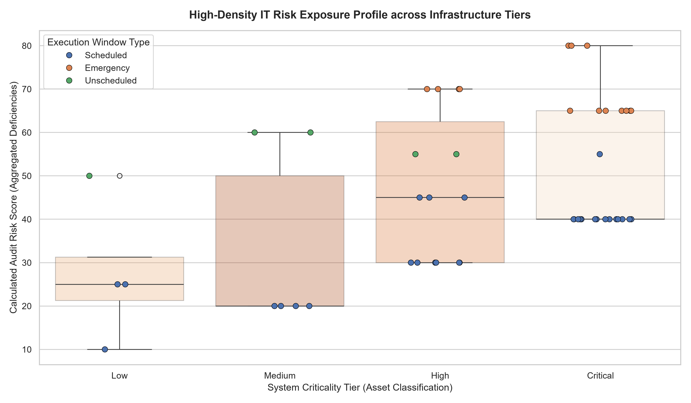

# Enterprise IT Asset & Change Management Audit Pipeline

### Technology Risk, Change Management & Compliance Analytics

> **Transform change logs into actionable technology risk intelligence.**

Enterprise IT Asset & Change Management Audit Pipeline is an **automated technology risk and compliance analytics pipeline** designed to support internal IT auditing through programmatic analysis of production change events.

The pipeline parses structured IT change management logs, applies custom audit and risk-scoring rules, identifies critical control violations, and generates analytical outputs that help highlight areas of elevated technology and compliance risk.

The solution demonstrates how operational IT data can be transformed into structured audit intelligence through:

**Change Logs → Data Processing → Audit Rules → Risk Scoring → Compliance Findings → Risk Visualization**

---

## 🚀 Project Overview

Organizations rely on structured change management processes to control modifications to production systems and reduce operational and technology risks.

Production changes may involve multiple control requirements, including:

* Change Authorization
* Developer and Approver Separation
* User Acceptance Testing (UAT)
* Emergency Change Procedures
* Management Approval
* System Criticality
* Change Risk

When change records are reviewed manually, identifying control violations across large numbers of events can become time-consuming and inconsistent.

**This project addresses this challenge by automating the analytical review of IT change management records.**

The pipeline evaluates individual change events against predefined governance and risk rules and produces a structured risk profile for further audit investigation.

---

## 🎯 Project Objective

The primary objective is to build an automated analytical pipeline capable of:

* Processing production change management logs
* Evaluating change events against predefined control rules
* Detecting Segregation of Duties violations
* Identifying critical control failures
* Calculating change-level risk scores
* Classifying higher-risk change events
* Visualizing the resulting risk distribution
* Supporting internal IT audit and compliance analysis

The project focuses on **automating repetitive audit analysis** while providing a structured view of technology risk.

---

## 💡 Project Vision

The project was built around one core question:

> **What if production change records could be automatically analyzed for control failures and risk before an auditor manually reviews every event?**

The pipeline connects:

* IT Change Management
* Governance Controls
* Compliance Rules
* System Criticality
* Risk Scoring
* Audit Findings
* Data Visualization

This creates an analytical flow from individual production changes to a consolidated technology risk profile.

---

## ✨ Strategic Audit Capabilities

| Capability                            | Description                                                                                                                                |
| ------------------------------------- | ------------------------------------------------------------------------------------------------------------------------------------------ |
| 🔐 Segregation of Duties              | Detects change events where the developer and production approver violate the defined separation-of-duties control.                        |
| 🚨 Critical Control Failure Detection | Identifies high-risk changes involving critical systems where required controls such as UAT or management authorization are not satisfied. |
| 📊 Risk Scoring                       | Calculates change-level risk using system criticality and compliance-related risk factors.                                                 |
| 🏢 System Criticality Analysis        | Incorporates infrastructure or system criticality into the overall risk profile.                                                           |
| 🔎 Change-Level Auditing              | Evaluates individual production change events rather than only providing aggregate statistics.                                             |
| 📈 Risk Visualization                 | Generates analytical visualizations showing the distribution and concentration of identified risk.                                         |
| ⚙️ Automated Audit Logic              | Applies predefined programmatic rules consistently across the change management dataset.                                                   |

---

## 🧩 Audit Analytics Architecture

The pipeline is structured around several connected analytical stages:

### 1. Change Management Data

The process begins with structured production change records containing information about individual IT changes.

The dataset includes simulated corporate change events representing production activity.

---

### 2. Data Processing

The pipeline loads and processes the change management records using Python and Pandas.

The processing stage prepares the data for:

* Rule evaluation
* Feature extraction
* Risk calculations
* Compliance analysis

---

### 3. Audit Rule Engine

The pipeline applies programmatic audit rules to identify control violations.

These rules evaluate areas such as:

* Developer / Approver Separation
* UAT Completion
* Emergency Change Conditions
* Management Authorization
* System Criticality

---

### 4. Risk Scoring

Each change event is evaluated using a custom risk-scoring approach.

The risk profile considers factors such as:

**System Criticality + Control Failures + Compliance Penalties**

This allows risk to be evaluated at the individual change-event level.

---

### 5. Audit Findings

The resulting analysis identifies change events requiring additional review based on their detected control failures and risk characteristics.

---

### 6. Risk Visualization

The resulting risk profile is visualized using statistical charts to help identify:

* Risk concentration
* Distribution of risk
* High-risk change events
* Differences across system criticality levels

---

## 🔄 Audit Pipeline Workflow

The complete analytical workflow follows:

```text
Production Change Logs
        ↓
Data Loading
        ↓
Data Cleaning & Feature Extraction
        ↓
Audit Rule Evaluation
        ↓
Control Violation Detection
        ↓
Risk Scoring
        ↓
Risk Classification
        ↓
Audit Findings
        ↓
Risk Visualization
```

This workflow demonstrates how manual audit checks can be translated into repeatable analytical rules.

---

## 🔐 Segregation of Duties (SoD)

**Segregation of Duties (SoD)** is one of the core audit checks implemented in the pipeline.

The system evaluates whether a production change violates the defined separation between the individual responsible for implementing a change and the individual responsible for approving it.

A potential violation is identified when:

**Developer = Approver**

This allows the pipeline to automatically flag change events requiring further audit review.

---

## 🚨 Critical Control Failure Detection

The pipeline also evaluates high-risk production changes involving critical systems.

Particular attention is given to emergency changes where required controls may not have been completed.

The audit logic considers conditions involving:

* Critical System Classification
* Emergency Change Windows
* User Acceptance Testing (UAT)
* IT Management Authorization

A combination of critical system conditions and missing control requirements can result in elevated risk.

---

## 📊 Risk Scoring Model

The pipeline applies a custom risk-scoring methodology at the change-event level.

The risk profile considers:

**Infrastructure / System Criticality**

combined with

**Compliance Failure Penalties**

to produce an overall risk score.

Conceptually:

```text
System Criticality
        +
Control Failure Penalties
        +
Compliance Risk Factors
        ↓
Change Risk Score
```

This approach allows individual production changes to be compared according to their relative risk characteristics.

---

## 🧠 Compliance & Governance Frameworks

The audit logic is designed with reference to established governance and cybersecurity frameworks, including:

### COBIT

Used as a governance reference for IT control and management principles.

### ISO/IEC 27001

Used as a reference point for information security management and control considerations.

### NCA Controls

Saudi National Cybersecurity Authority controls are considered as a regional cybersecurity governance reference.

> The project uses these frameworks as analytical and governance references; it does not represent a formal certification or compliance assessment.

---

## 📈 Risk Profile Visualization

The pipeline generates an analytical visualization showing the distribution of technology risk across production change events.

The visualization combines:

* Risk Distribution
* System Criticality
* Individual Change Events
* Statistical Comparison



The visualization provides a high-density view of how individual change events are distributed across the broader risk profile.

---

## 📋 Audit Dataset

The project includes a simulated corporate dataset containing:

**50 production system change events**

The dataset is designed to represent realistic change management scenarios and provide sufficient variation for audit-rule testing and risk analysis.

The change records allow the pipeline to evaluate different combinations of:

* System Criticality
* Change Type
* Approval
* UAT Status
* Emergency Changes
* Developer / Approver Relationships
* Risk Factors

---

## 🛠️ Technology Stack

### Programming

* **Python 3.12**

### Data Analytics

* **Pandas**
* Data Processing
* Feature Extraction
* Risk Calculation
* Rule-Based Analysis

### Data Visualization

* **Matplotlib**
* **Seaborn**

The visualization layer is used to generate analytical representations of the resulting technology risk profile.

---

## 📁 Project Structure

```text
Enterprise-IT-Asset-Change-Management-Audit-Pipeline/
│
├── it_audit_logs.csv
│
├── audit_pipeline.py
│
├── advanced_it_audit_risk_profile.png
│
└── README.md
```

---

## 🎯 Skills Demonstrated

This project demonstrates practical experience in:

* Python
* Pandas
* Data Analytics
* Data Processing
* Feature Extraction
* Rule-Based Risk Analysis
* Technology Risk Analytics
* IT Audit Analytics
* Change Management Analysis
* Compliance Analytics
* Risk Scoring
* Data Visualization
* Governance Concepts
* ISO/IEC 27001
* COBIT
* NCA Controls
* Automated Audit Analysis

---

## 🔮 Future Improvements

Potential future enhancements include:

* Interactive Power BI risk dashboard
* Automated audit report generation
* Expanded control libraries
* Configurable risk-scoring rules
* Additional IT governance frameworks
* Historical risk trend analysis
* Automated exception reporting
* Integration with enterprise change-management platforms
* Machine Learning-based anomaly detection
* Automated high-risk change alerts

These enhancements could extend the pipeline from rule-based audit analytics toward **continuous technology risk monitoring**.

---

## 📌 Project Summary

Enterprise IT Asset & Change Management Audit Pipeline demonstrates how Python-based analytics can automate key aspects of internal IT change auditing.

The project combines:

**Change Management Data + Audit Rules + Risk Scoring + Compliance Analysis + Data Visualization**

to identify potential control violations and highlight higher-risk production changes.

By converting structured change records into analytical risk profiles, the solution demonstrates how **data analytics can support IT governance, technology risk management, and internal audit processes**.

---

## 👩🏻‍💻 Author

**Dana Khalid Alhazmi**

Information Systems Graduate
Data & Business Intelligence | Building Data-Driven Enterprise Solutions

[GitHub](https://github.com/danalhazmi)
